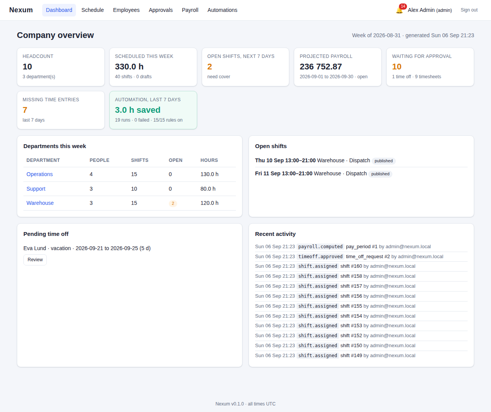
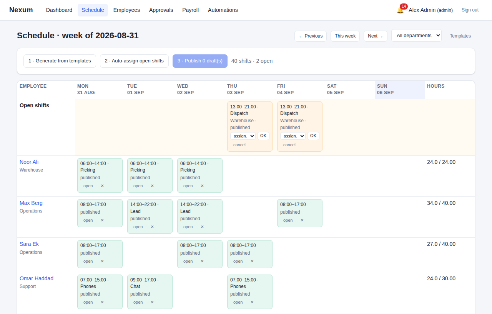
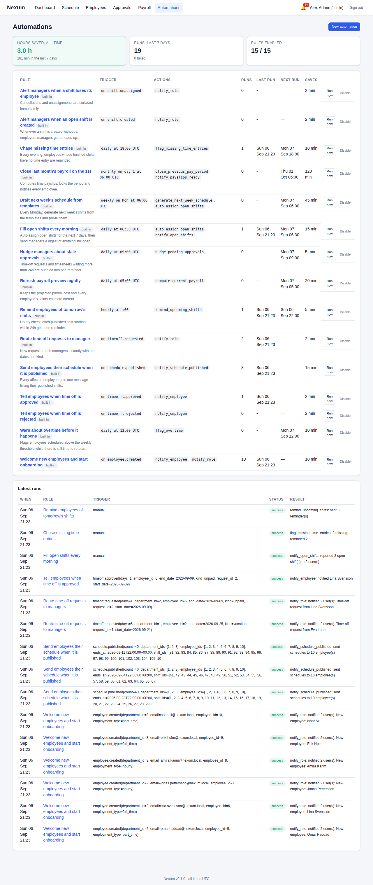
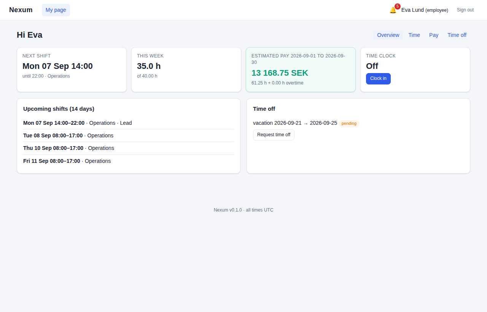

# Nexum

All-in-one company overview platform: administrators get the right numbers, employees get
their schedules and pay, and an automation engine does the coordination work in between.

- **Overview** — headcount, scheduled hours, open shifts, projected payroll, approvals backlog, and how many hours the automations saved.
- **Scheduling** — weekly templates, draft → publish flow, open shifts, auto-assignment that respects clashes, time off and weekly hours.
- **Time & attendance** — clock in/out, manual entries, manager approval, automatic chasing of missing entries.
- **Payroll** — monthly pay periods, weekly overtime, unpaid-leave deductions, payslip previews for employees, close/pay lifecycle with an audit trail.
- **Employee self-service** — my shifts, my pay estimate, my time, my requests, notifications.
- **Automation** — rules made of *trigger → conditions → actions*, 15 built-in recipes, run history, and an "hours saved" figure on the dashboard.

Everything is served by one Python process (FastAPI) with a server-rendered UI, a JSON API
(`/api/docs`), and a CLI.

| Admin dashboard | Schedule grid |
|---|---|
|  |  |

| Automations | Employee page |
|---|---|
|  |  |

## Quick start

Requires Python 3.11+ and [uv](https://docs.astral.sh/uv/).

```bash
uv sync --all-extras --dev      # install
uv run nexum seed               # demo company "Nexum Demo AB" + built-in automations
uv run nexum serve              # http://127.0.0.1:8000
```

Demo logins (password `demo1234`):

| Role | Email | Lands on |
|---|---|---|
| admin | `admin@nexum.local` | `/dashboard` |
| manager | `manager@nexum.local` | `/dashboard` |
| employee | `eva.lund@nexum.local` (and the other employees) | `/me` |

Start from scratch instead of the demo:

```bash
uv run nexum init-db                       # schema + built-in automation recipes
uv run nexum create-admin                  # prompts for email, name, password
uv run nexum serve
```

## CLI

```
nexum init-db [--drop]                   create the schema and install recipes
nexum seed [--reset]                     load the demo company
nexum serve [--host] [--port] [--reload]  run the app with uvicorn
nexum create-admin                       create an administrator login
nexum automations list                   rules, triggers, run counts, next run
nexum automations run-due                run every scheduled rule that is due (cron-friendly)
nexum automations fire <id|key>          run one rule now
nexum automations install-recipes [--reset]
```

## Configuration

Environment variables (prefix `NEXUM_`) or a `.env` file; see [`.env.example`](.env.example).

| Variable | Default | Meaning |
|---|---|---|
| `NEXUM_DATABASE_URL` | `sqlite:///./nexum.db` | SQLAlchemy URL; `postgresql+psycopg://...` for PostgreSQL (`uv sync --extra postgres`) |
| `NEXUM_SECRET_KEY` | change-me | signs session cookies; **set this in production** |
| `NEXUM_ENVIRONMENT` | `development` | `production` enables secure cookies |
| `NEXUM_AUTOMATION_ENABLED` | `true` | background ticker for scheduled rules |
| `NEXUM_AUTOMATION_TICK_SECONDS` | `30` | ticker interval |
| `NEXUM_AUTOMATION_WEBHOOKS_ENABLED` | `false` | allow the `webhook` action to call out |
| `NEXUM_DEFAULT_CURRENCY` | `SEK` | currency for new pay periods |
| `NEXUM_WEEKLY_OVERTIME_THRESHOLD_HOURS` | `40` | hours per ISO week before overtime |
| `NEXUM_OVERTIME_MULTIPLIER` | `1.5` | overtime pay multiplier |

## Docker

```bash
docker compose up --build        # app + PostgreSQL on http://localhost:8000
docker compose exec app nexum seed
```

## Development

```bash
uv run ruff check src tests && uv run ruff format --check src tests
uv run mypy
uv run pytest --cov=nexum
```

Project layout and design notes: [`docs/ARCHITECTURE.md`](docs/ARCHITECTURE.md).
Automation rule language, actions and recipes: [`docs/AUTOMATION.md`](docs/AUTOMATION.md).
Product plan, roadmap and backlog to v1.0: [`docs/PLAN.md`](docs/PLAN.md).

## Status

This is the M0 foundation (see the plan). It runs a complete flow — people, templates,
schedule, time, payroll, automations — on SQLite or PostgreSQL, with tests at ~96% line
coverage. All times are UTC in this version; migrations, e-mail delivery, availability and
localised payroll rules are the next milestones.

## License

MIT
