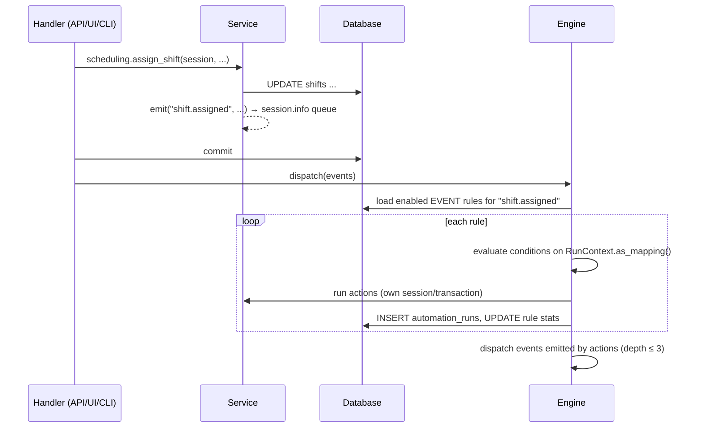

# Architecture

Nexum is a modular monolith: one Python process serves the web UI, the JSON API and the
automation engine; one database holds everything. This document explains how the pieces
fit so a new contributor can find their way in an afternoon.

## Module map

```
src/nexum/
├── config.py            Settings (env vars, NEXUM_ prefix, .env file)
├── db.py                Engine/session factory, Base, init_db, session_scope
├── errors.py            Domain exceptions mapped to HTTP codes by the app
├── main.py              FastAPI app factory, middleware, exception handlers, lifespan
├── cli.py               `nexum` command line (typer)
├── models/              SQLAlchemy 2.0 typed models (one file per bounded area)
├── services/            Business logic; takes a Session, never commits, emits events
│   ├── events.py        DomainEvent, emit(), commit_and_dispatch(), dispatcher registry
│   ├── people.py        users, departments, employees, time off
│   ├── scheduling.py    shifts, templates, conflicts, auto-assign, publish
│   ├── time_tracking.py clock in/out, manual entries, approvals, missing entries
│   ├── payroll.py       pay periods, payslip calculation, close/pay lifecycle
│   ├── dashboard.py     aggregated numbers for admin and employee views
│   ├── notifications.py in-app notifications (user, employee, role)
│   ├── audit.py         audit log helper
│   ├── security.py      scrypt password hashing
│   └── calendar.py      week/month helpers (UTC, weeks start Monday)
├── automation/          The engine
│   ├── engine.py        AutomationEngine: handle_event, tick, run_rule, background ticker
│   ├── schedule.py      next_run() for interval/hourly/daily/weekly/monthly triggers
│   ├── conditions.py    safe condition language (no eval)
│   ├── context.py       RunContext, ActionResult, event enrichment, message templating
│   ├── actions.py       action registry + built-in actions
│   └── recipes.py       built-in rules, upserted by key
├── api/                 JSON API under /api/v1 (routers per area, pydantic schemas, deps)
└── web/                 Server-rendered UI (routes.py, templating.py, templates/, static/)
```

## Request lifecycle

1. A request hits FastAPI. `SessionMiddleware` (signed cookie) carries the user id.
2. Dependencies in `api/deps.py` resolve the database session and the current user, and
   enforce roles (`CurrentUser`, `ManagerUser`, `AdminUser`, `CurrentEmployee`). Both the
   API and the web routes reuse them.
3. The handler parses input (pydantic model or HTML form), calls **one** service function,
   then `commit_and_dispatch(session)`.
4. `commit_and_dispatch` commits and only then hands the queued domain events to the
   registered dispatchers (the automation engine).
5. Domain errors (`NexumError` subclasses) become JSON `{detail}` responses under `/api/`
   and an HTML error page (or a login redirect) elsewhere. Web POST handlers use
   `guarded()` which turns a domain error into a flash message and a redirect back.

## Event flow



Event names and payload keys are listed in `docs/AUTOMATION.md`. Payloads only contain
JSON-friendly values (ids, ISO dates, enum values) so they can be logged and matched.

## The engine

- **Triggers.** `SCHEDULE` rules carry `trigger_config` such as `{"kind": "daily", "at": "06:30"}`;
  `EVENT` rules carry `{"event": "shift.created"}`; `MANUAL` rules only run from the UI/API/CLI.
- **Tick.** `AutomationEngine.tick(now)` loads enabled schedule rules; a rule with no
  `next_run_at` is scheduled (not run); a rule whose `next_run_at <= now` runs once and is
  then advanced with `schedule.next_run(config, now)`. A ticker that was down for days
  therefore catches up with a single run per rule, not one per missed slot. The background
  ticker is a daemon thread started in the app lifespan (`NEXUM_AUTOMATION_ENABLED`,
  `NEXUM_AUTOMATION_TICK_SECONDS`); the CLI `nexum automations run-due` does the same once.
- **Run.** `run_rule` builds a `RunContext` (session, settings, rule, now, event), evaluates
  the conditions and executes the actions in order in **one transaction**. A domain or
  unexpected error rolls that transaction back, then a `FAILED` run row with the error is
  written. Successful runs record the log lines; `minutes_saved` is credited only when at
  least one action reported `work_done`.
- **Event non-matches are not persisted.** An event rule sees every event of its kind;
  when its conditions do not match, nothing is written (a debug log line only). Manual and
  scheduled runs with unmet conditions are recorded as `SKIPPED` so operators can see them.
- **Loops.** Actions may emit events (for example creating shifts). They are dispatched
  after the run commits, with a depth counter; beyond `MAX_EVENT_DEPTH` (3) events are dropped
  with a warning.
- **Idempotency.** Actions that notify people set a `source` on the notification
  (`shift-reminder:<id>`, `missing-entry:<id>`, `overtime:<week>:<rule>`, ...) and check
  for it before sending, so re-runs and catch-ups do not double-notify.

## Data model

| Table | Purpose | Notable columns |
|---|---|---|
| `users` | logins | `email` (unique), `role` admin/manager/employee, `password_hash` (scrypt) |
| `departments` | org units | `manager_id` (self-referencing through employees, `post_update`) |
| `employees` | people and contracts | `pay_type` monthly/hourly, `monthly_salary`, `hourly_rate`, `weekly_hours` (fixed-point), `user_id` optional |
| `schedule_templates` | weekly recurring need | `weekday`, `start_time`, `end_time`, `headcount`, `role_label` |
| `shifts` | scheduled work | `employee_id` nullable (open shift), `status` draft/published/cancelled, `template_id` |
| `time_entries` | worked time | `clock_in`, `clock_out`, `break_minutes`, `status` open/submitted/approved/rejected, `shift_id` |
| `time_off_requests` | leave | `kind`, `status`, `decided_by_user_id` |
| `pay_periods`, `payslips` | payroll | period `status` open/closed/paid; payslip amounts + `details` JSON breakdown |
| `automation_rules`, `automation_runs` | engine | rule JSON columns; run `status`, `log`, `error`, `minutes_saved` |
| `notifications` | in-app inbox | `level`, `link`, `source` (dedupe key), `is_read` |
| `audit_log` | who did what | `action`, `entity_type`, `entity_id`, `details` |

All datetimes are stored naive-UTC and returned aware-UTC by the `UTCDateTime` type.
Money and hours use `FixedPoint` (scaled integers) so SQLite and PostgreSQL behave the same.

## Configuration

Settings come from environment variables with the `NEXUM_` prefix or a `.env` file; see
`.env.example`. Tests set `NEXUM_ENVIRONMENT=test`, which disables the background ticker.

## Testing strategy

- `tests/conftest.py` gives every test a fresh in-memory SQLite database (a shared
  `StaticPool` connection so worker threads see the same data), a fake clock, an engine
  subscribed to events, and a small company fixture.
- Unit tests cover the condition language, schedule maths, security and calendar helpers.
- Service tests cover scheduling constraints, payroll rules and lifecycle.
- Engine and action tests run rules end to end, including failure rollback and loop limits.
- API and web tests drive the HTTP surface with the FastAPI test client; templates use
  `StrictUndefined`, so a typo in a template fails a test instead of rendering blank.
- CLI tests use typer's `CliRunner` against a temporary file database, including the demo seed.

CI runs ruff, mypy (strict), pytest with a coverage floor, the seed, and a Docker build
that must answer `/healthz`.

## Deployment

- `Dockerfile` builds a slim image with `uv`; the container runs `nexum init-db` then uvicorn.
- `docker-compose.yml` adds PostgreSQL 16; set `NEXUM_SECRET_KEY` before exposing it.
- The automation ticker runs inside the web process. Run exactly one web replica until the
  ticker is moved to a dedicated worker (planned in M4, see `docs/PLAN.md`); with several
  replicas each would run the scheduled rules.
