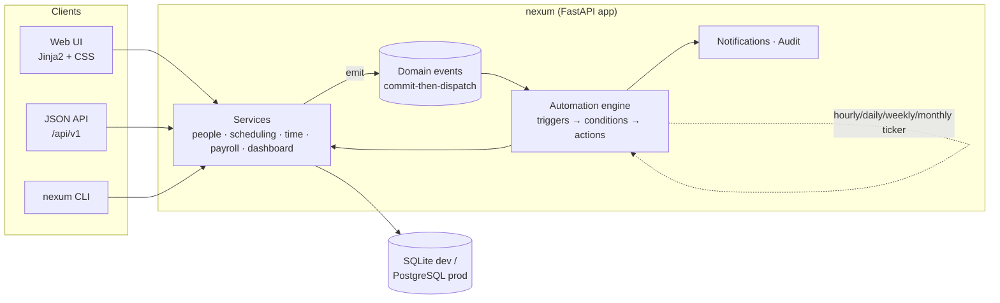

# Nexum product plan

Nexum is an all-in-one company overview platform: administrators get the right numbers,
employees get their schedules and pay, and an automation engine does the coordination
work in between. This document is the plan for taking the product from the foundation on
this branch to a finished v1.0.

It is organised so you can read it top-down (vision, scope, roadmap) or jump to the
issue-ready backlog at the end.

---

## 0. Where we are

Version 0.2.0 (this branch) delivers the M0 foundation plus most of milestones M1 to M6.
The table shows what exists today; the roadmap in section 4 lists what is still open.

| Area | Status | Notes |
|---|---|---|
| Domain model | done | users/roles, company settings, departments, employees with skills and availability, shifts + templates, shift requests, time entries, time off, pay periods/payslips, automation rules/runs, notifications, audit log, reset tokens |
| Services | done | scheduling (templates, conflicts, availability, skills, auto-assign, publish, claims/drops/hand-overs), time tracking (breaks, rounding), payroll (weekly overtime, premiums, holidays, bi-weekly, vacation balance, exports), dashboards and reports |
| Automation engine | done | schedule/event/manual triggers in company time, safe condition language, 23 actions, retries, dry runs, run history, hours-saved accounting, 29 built-in recipes |
| Delivery | done | in-app, e-mail (SMTP, per-user opt-out), Slack/Teams incoming webhooks, generic webhook |
| JSON API | done | `/api/v1`, session auth, RBAC, OpenAPI at `/api/docs` |
| Web UI | done | setup wizard, dashboard, employees (edit, export, anonymise), schedule grid, templates, approvals (time off, timesheets, shift requests), payroll with payslips and CSV, automations with editor/report, settings, employee self-service (shifts, availability, time, pay, requests) |
| Operations | done | company time zone, migrations (`nexum db`), CSRF, security headers, rate-limited login, password reset, request ids, `/healthz` |
| Quality gates | done | ruff, mypy strict, ~140 tests at ~95% coverage on SQLite and PostgreSQL, CI (lint, types, tests, migrations check, seed smoke, Docker build, PostgreSQL job) |

Try it:

```bash
uv sync --all-extras --dev
uv run nexum seed          # demo company, logins printed at the end
uv run nexum serve         # http://127.0.0.1:8000
uv run pytest
```

## 1. Product definition

**One line.** Nexum gives a company one place for people, schedules, time and pay, and
automates the coordination chores around them so managers spend their time on people
instead of spreadsheets.

**The problem.** Small and mid-sized companies with shift-based or mixed staff (retail,
hospitality, logistics, support teams, clinics, agencies) run on a patchwork: a scheduling
spreadsheet, a chat group for swaps, e-mail for time off, a payroll export assembled by
hand at month end, and nobody has an overview until something goes wrong. The cost is not
the tools; it is the hours of manual chasing, the errors in pay, and the decisions made
without numbers.

**Who it is for.**

| Persona | Cares about | Nexum gives them |
|---|---|---|
| Admin / owner / HR / finance | headcount, labour cost, payroll correctness, compliance, audit trail | the dashboard, payroll periods, audit log, automation control |
| Manager / team lead | a filled schedule, approvals handled, no surprises | schedule grid, auto-assign, approvals page, alerts |
| Employee | "when do I work, what will I earn, is my request approved" | `/me`: shifts, clock in/out, pay estimate, requests, notifications |

**The automation thesis.** Effectiveness comes from removing recurring coordination
tasks, not from adding features. Every built-in automation names a manual task it
replaces (drafting the week from templates, filling open shifts, chasing timesheets,
reminding about tomorrow's shift, closing payroll on the 1st) and carries an
`estimated_minutes_saved`. The dashboard turns that into "hours saved", so the value of the
automation is visible to the people paying for it. Rules are data, not code: an admin can
add a rule from the UI without a deploy.

---

## 2. Scope of v1.0 ("finished")

v1.0 is the product a pilot customer can run for a full payroll cycle without a developer
on call.

**Must have**

- Organisation: departments, employees, contracts (pay type, rate, weekly hours), logins with three roles, deactivation, CSV import.
- Scheduling: weekly templates, draft/publish flow, open shifts, auto-assign with constraints (clashes, time off, weekly hours, department), employee availability preferences, shift swap/claim requests with manager approval, iCal feed.
- Time & attendance: clock in/out, manual entries, approval queue, missing-entry chasing, break and rounding rules.
- Payroll: monthly (and bi-weekly) periods, weekly overtime, unsocial-hours premiums by time-of-day/weekday, unpaid leave deduction, vacation accrual balance, payslip PDF, export for bookkeeping (generic CSV first, Swedish SIE format second), locked periods with an audit trail.
- Overview: dashboard with headcount, coverage, labour cost vs budget, overtime trend, absence rate, approvals backlog, automation value; per-department view; CSV export of every table.
- Automation: schedule/event triggers, condition language, action library, in-app + e-mail delivery (Slack/Teams via webhook), rule builder UI (no JSON required), run history with retries, "dry run", per-department scoping, effectiveness report.
- Platform: PostgreSQL with migrations, Docker image, backups documented, password reset, optional OIDC SSO, CSRF protection, rate limiting, GDPR export/delete of an employee's data, company time zone.

**Explicitly out of scope for v1.0**

- Full accounting or tax filing (we export to the bookkeeping system instead).
- Native mobile apps (the web UI is responsive; a PWA wrapper is a v1.x item).
- Biometric or hardware time clocks (an API for them exists).
- Multi-company SaaS tenancy (the data model is single-company; a tenant column is a v1.x migration, not a rewrite).

---

## 3. Architecture (as built)

A modular monolith in Python 3.11+, chosen so one engineer can hold the whole system in
their head and ship quickly, while module boundaries keep a later split possible.



Key design points (see `docs/ARCHITECTURE.md` for detail):

- **Services own the rules, handlers stay thin.** Every business operation lives in `nexum.services.*`, takes a SQLAlchemy session, never commits, and emits domain events. The API and web layers only parse input, call a service, commit-and-dispatch.
- **Events are delivered after commit.** Automations never react to state that was rolled back. Nested events (an action that creates shifts) are depth-limited to stop loops.
- **Automation rules are data.** `trigger_config`, `conditions` and `actions` are JSON columns validated against the action registry and a small safe condition language (no `eval`). Built-in recipes are upserted by key so upgrades can ship new defaults without touching customised rules.
- **Money and hours are exact.** Stored as scaled integers (`FixedPoint`), computed with `Decimal`, identical on SQLite and PostgreSQL.
- **UTC everywhere in v0.1.** The UI says so in its footer. Company time zone is an M1 item.

---

## 4. Roadmap

Seven milestones, roughly 14 to 17 weeks for one full-time engineer plus part-time design
and a pilot customer contact. Each milestone ends with a demo and a tagged release.

| # | Milestone | Weeks | Exit criteria |
|---|---|---|---|
| M0 | Foundation | done | v0.1.0: green CI, seedable demo, all modules present |
| M1 | Operate safely | done (0.2.0) | migrations, Postgres in CI, company time zone; still open: backup runbook, CSV employee import |
| M2 | Scheduling v1 | done (0.2.0) | availability, claims/drops/hand-overs, skills, iCal feed, print view; still open: coverage view |
| M3 | Time & payroll v1 | mostly done (0.2.0) | premiums, holidays, rounding, bi-weekly, vacation balance, printable payslips, CSV; still open: payslip PDF/e-mail, SIE/Fortnox exports, reconciliation view |
| M4 | Automation v1 | mostly done (0.2.0) | e-mail + chat + webhook, structured trigger editor, retries, dry runs, report, 14 new recipes; still open: condition/action builder without JSON, digest mode, per-department scoping |
| M5 | Insight | 2 | trends, budgets, coverage heatmap, exports, `v0.6.0` |
| M6 | Security & compliance | mostly done (0.2.0) | password reset, CSRF, rate limits, security headers, GDPR export/anonymise; still open: OIDC, retention job, external review |
| M7 | Launch | 1–2 | setup wizard done; still open: docs site, monitoring, load test, pilot sign-off, `v1.0.0` |

### M1 · Operate safely (2 weeks)

Goal: a customer database that survives upgrades.

- Alembic set up with an initial migration generated from the current models; `init_db` becomes "run migrations" outside tests.
- CI matrix job against PostgreSQL 16 (service container); fix any dialect differences (JSON queries, enum lengths).
- Company settings table: name, time zone, currency, overtime threshold, multiplier, week start. Replace the env-based payroll defaults.
- Time zone: store UTC, render and parse in the company zone; schedule templates and daily automations run in company time.
- CSV import for employees and departments with a preview step; export for every table.
- Backup/restore runbook for SQLite and Postgres; `nexum backup` helper.
- Structured logging + request ids; `/healthz` reports DB and ticker status.

### M2 · Scheduling v1 (3 weeks)

Goal: managers stop using the spreadsheet.

- Availability: employees mark recurring unavailability and one-off preferences; auto-assign respects them and scores preferences.
- Skills/roles: templates can require a skill; employees carry skills; candidate ranking uses them.
- Shift swaps and open-shift claims by employees, with manager approval and automatic conflict checks; events `shift.swap_requested`, `shift.claimed`.
- Schedule copy ("copy last week"), bulk edit, notes visible to employees.
- iCal feed per employee (signed URL) and a printable week view.
- Coverage view: required headcount per hour vs assigned.

### M3 · Time & payroll v1 (3 weeks)

Goal: one full month of payroll produced by Nexum and accepted by the bookkeeper.

- Configurable premiums ("OB" in Sweden): multipliers by weekday/time window and public holidays; holiday calendar per country.
- Break and rounding rules (nearest 5/15 minutes, automatic unpaid break after N hours).
- Bi-weekly and custom periods; period locking with reopen-by-admin and audit entry.
- Vacation accrual and balance (days earned per month, taken via approved time off).
- Payslip PDF (WeasyPrint or ReportLab) and e-mail delivery through the notification channel.
- Exports: generic CSV, Swedish SIE4 (bookkeeping) and a Fortnox/Visma-shaped CSV as first integrations; exports are idempotent per period.
- Payroll reconciliation view: differences between scheduled, worked and paid hours per employee.

### M4 · Automation v1 (3 weeks)

Goal: a non-technical admin builds a rule in under two minutes and trusts it.

- Delivery channels: e-mail (SMTP), generic webhook (already), Slack and Microsoft Teams incoming webhooks; per-user channel preferences; digest mode.
- Rule builder UI: pick trigger, add conditions with dropdowns, add actions with forms; live "what would this have done last week" dry run.
- Reliability: retries with backoff for transient action failures, dead-letter list, run timeouts, per-rule circuit breaker, idempotency keys on notifications.
- Scoping: rules per department; template variables documented in the UI.
- Effectiveness report: hours saved per rule, response time from event to action, notification open/ack rates; exported monthly.
- More recipes: no-show detection (no clock-in 15 min after start), late clock-out, understaffing forecast, contract renewals, birthdays/anniversaries.

### M5 · Insight (2 weeks)

- Labour cost vs budget per department and month; overtime and absence trends; coverage heatmap; headcount changes.
- Saved views and CSV/Excel export; scheduled report e-mail via the automation engine.

### M6 · Security & compliance (2 weeks)

- Password reset by e-mail, password policy, session management (revoke all), optional OIDC (Google Workspace, Microsoft Entra).
- CSRF tokens on all forms (today: `SameSite=Lax` cookies), rate limiting on login, security headers, dependency audit in CI.
- GDPR: export and erase an employee's data, retention policy for time entries and notifications, access log.

### M7 · Launch (1–2 weeks)

- First-run onboarding wizard (company, admin, departments, first template, first employees).
- Documentation site (user guide, admin guide, API reference generated from OpenAPI).
- Monitoring: OpenTelemetry traces + metrics, error reporting, alert on ticker stall.
- Load test (500 employees, 20k shifts/month) and index review.
- Pilot: two weeks with a real team, weekly feedback loop, punch list, then `v1.0.0`.

---

## 5. Definition of done for v1.0

- A pilot company has run one complete payroll cycle in Nexum with no manual correction of computed amounts.
- Every must-have in section 2 is shipped and covered by tests; CI green on SQLite and PostgreSQL.
- Upgrades run by migration; a documented backup/restore has been rehearsed.
- Security items in M6 complete; an external review of auth and payroll code done.
- Automation "hours saved" for the pilot exceeds 5 hours/week with zero failed runs left unhandled.
- Onboarding a new company takes under 30 minutes using only the wizard and docs.

---

## 6. Backlog (issue-ready)

Priority: P0 blocks the next milestone, P1 needed for v1.0, P2 valuable later. Each item
has an acceptance criterion so it can be copied straight into a GitHub issue.

**P0**

1. ~~Alembic migrations with initial revision; `nexum db upgrade`.~~ Done in 0.2.0 (`nexum db`, CI check on SQLite and PostgreSQL).
2. ~~PostgreSQL CI job.~~ Done in 0.2.0.
3. ~~Company settings model replacing env-based payroll defaults.~~ Done in 0.2.0 (`/settings`).
4. ~~Company time zone rendering and parsing in the UI.~~ Done in 0.2.0.
5. ~~CSRF tokens on web forms.~~ Done in 0.2.0.

**P1**

6. ~~Employee availability + preference scoring in auto-assign.~~ Done in 0.2.0.
7. ~~Shift swap and claim requests with approval and events.~~ Done in 0.2.0.
8. ~~Skills on templates and employees; candidate ranking uses them.~~ Done in 0.2.0.
9. ~~Premium (unsocial hours) rules and holiday calendar in payroll.~~ Done in 0.2.0.
10. ~~Break/rounding rules; vacation accrual and balance.~~ Done in 0.2.0.
11. Payslip PDF and e-mail delivery (the SMTP channel with per-user preferences is done; printable payslip pages exist).
12. Bookkeeping exports (CSV, SIE4).
13. Condition/action builder without JSON (structured trigger editor, dry runs and retries are done).
14. Digest mode (incoming-webhook channel is done).
15. ~~Password reset and OIDC login; login rate limiting.~~ Done in 0.2.0 (OIDC and the docs site remain).
16. Retention job as an automation recipe (GDPR export/erase is done).
17. CSV import/export for employees, departments, shifts.
18. ~~iCal feed and printable schedule.~~ Done in 0.2.0.
19. Dashboard trends (labour cost vs budget, overtime, absence).
20. ~~Onboarding wizard and user/admin docs site.~~ Done in 0.2.0 (OIDC and the docs site remain).

**P2**

21. Effectiveness report with response times and acknowledgement rates.
22. Coverage heatmap and understaffing forecast recipe.
23. Cron-expression schedules and per-rule time zone.
24. PWA wrapper for the employee pages; push notifications.
25. Multi-company tenancy (tenant id on every table, per-tenant settings).
26. Hardware time-clock API (device tokens, offline buffering).

---

## 7. Risks and mitigations

| Risk | Impact | Mitigation |
|---|---|---|
| Payroll rules differ by country and collective agreement | wrong pay erodes trust fast | keep rules as configurable data (premium windows, thresholds); ship Sweden first; reconciliation view; period locking with audit |
| Automation sends noise, people ignore it | value thesis fails | dedupe by `source` (done), digest mode, per-user preferences, "hours saved" only counts productive runs |
| SQLite in production | data loss, concurrency limits | compose ships Postgres; migrations in M1; docs say SQLite is for evaluation |
| Scope creep from pilot feedback | v1.0 never ships | milestone exit criteria + backlog triage weekly; P2 list is the parking lot |
| Single engineer bus factor | | modular monolith with strict typing, tests at ~94%, docs in repo, seed data for onboarding a second engineer |
| Security of salary data | breach = company-ending for a customer | M6 before launch, external review, least-privilege roles already enforced in API and UI |

---

## 8. Decisions log

- **D1 Python + FastAPI modular monolith.** Fastest path for a small team; typed end-to-end; the module boundaries (`services`, `automation`, `api`, `web`) allow a later split.
- **D2 Server-rendered UI first.** No build toolchain, one language, fully testable with the HTTP test client. A richer SPA can grow on the JSON API later without rewriting logic.
- **D3 In-house automation engine, no Celery/Redis in v0.1.** The workload is small and latency-tolerant (a ticker every 30 s); avoiding a broker keeps deployment to one container plus a database. Revisit at M4 if action volume or isolation needs demand it.
- **D4 Rules as JSON data with a validated action registry.** Lets admins change behaviour without deploys and keeps the blast radius of a bad rule to one run.
- **D5 Events dispatched after commit, depth-limited.** Correctness over immediacy; no automation ever acts on uncommitted state.
- **D6 Fixed-point money/hours.** Exactness on both databases; SQLite has no decimal type.
- **D7 UTC-only in v0.1.** Simpler correctness now; company time zone is the first M1 item because it is the most visible gap.
- **D8 scrypt from the standard library for passwords.** No extra dependency; swap to argon2 when a dependency review allows.
- **D9 Recipes upserted by key.** Upgrades can add or fix built-ins without overwriting operator changes (enabled flag is preserved).

---

## 9. Working agreements

- Branch from `main`, PR per backlog item, CI (ruff, mypy strict, pytest with coverage floor, Docker build) must be green.
- Semantic versions per milestone; changelog in the release notes.
- Every service function has a test; every UI page has at least a render test; every new action has a test that runs it through the engine.
- Migrations reviewed by a second person before merge once M1 lands.

---

## 10. Next two weeks (concrete)

1. Merge this branch and tag `v0.2.0`; deploy the compose stack for an internal trial.
2. Pilot: load the pilot company's real templates, premium windows and holidays through
   `/settings` and `/templates`; run one payroll period in parallel with the current
   process and reconcile the CSV export line by line.
3. Insight (M5): labour cost per department and month, overtime and absence trends,
   coverage heatmap; scheduled report e-mail via the automation engine.
4. Close the M3/M4 gaps that block bookkeeping: payslip PDF by e-mail, SIE export,
   and the condition/action builder so admins never touch JSON.
5. Launch prep (M7): backup/restore runbook, OpenTelemetry metrics, load test with
   500 employees, user guide, then the pilot sign-off for `v1.0.0`.
